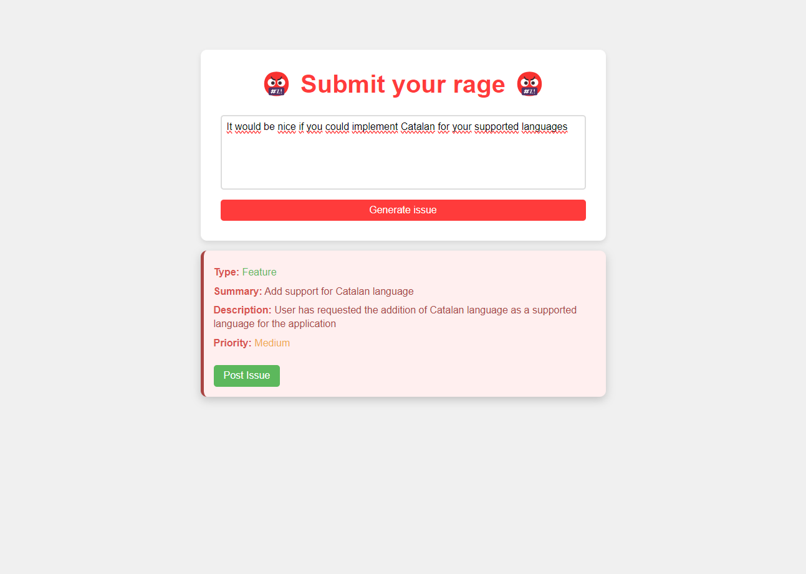
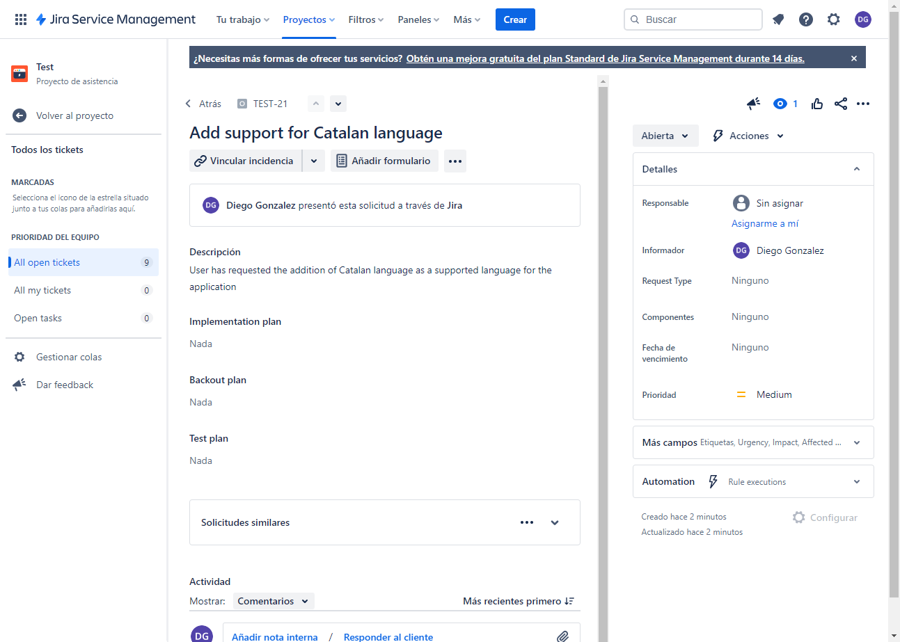

# 😡 JiRage 😡

## Overview 🌐
This project was done for the [HackEPS2023](https://devpost.com/software/jirage?ref_content=user-portfolio&ref_feature=in_progress)

This is a web-based application designed to collect user feedback and create corresponding issues in JIRA. It
features a frontend for submitting feedback and a Flask-based backend that processes this feedback, categorizing it into
issues with varying priorities using ChatGPT. These issues are then posted to JIRA, streamlining the tracking and management process.


### Features 🌟

- **User Feedback Form**: A simple and intuitive interface for users to submit feedback.
- **Flask Backend**: Processes the feedback, classifying it into different categories and priorities using the OpenAI api.
- **JIRA Integration**: Automatically creates issues in JIRA based on user feedback.
- **Dockerized Setup**: Ensures consistency across development and production environments.

## Getting Started 🚦

### Prerequisites 📋

- Docker
- Git (for cloning the repository)
- An `.env` file in the backend directory with the following variables:

```
OPENAI_API_KEY=xxx
JIRA_API_TOKEN=xxx
JIRA_EMAIL=xxx
PORT=xxx
```

### Installation 🔧

1. **Clone the Repository**

``` bash
git clone [repository-url]
```

2. **Create a .env File**
   Navigate to the backend directory and create a `.env` file with the necessary environment variables.


3. **Build and Run with Docker Compose**

``` bash
docker-compose up --build
```

This command will build and start both the frontend and backend services.

## Usage 📚

### Submitting Feedback
Access the frontend at `http://localhost` and submit feedback using the provided form.



### Backend Endpoints
- **POST /create_issue**: Endpoint for creating a new issue from the submitted feedback.
- **POST /post_issue**: Endpoint for posting the created issue to JIRA.

### Viewing Generated Issues
Access your JIRA dashboard to see the issues created based on the user feedback.


